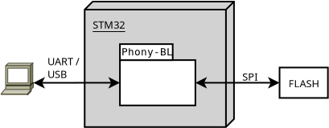
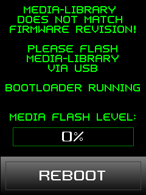

# Libphonybl (Phony BL)

## Overview

Phony-BL simulates the UART ROM bootloader of an STM32 device. It can be used 
to flash the content of an extern SPI flash or an EEPROM while using existing 
tools on the host side. The library contains an C++ class which can be 
integrated in existing applications (see [Porting](#Porting)).



The command line tool of STM32CubeProgrammer can be use to flash the firmware.

## Prerequisite

Only debian is tested for host system. Following packages/applications are needed to get libphonybl running:

* cmake
* build-essential
* [STM32CubeProgrammer](https://www.st.com/en/development-tools/stm32cubeprog.html) can be used for flashing
* [liblepto](https://github.com/maxses/liblepto)
* When building for STM32 targets, an accordingly toolchain is needed

## Compile test application for host

The host test application 'phony' does not do anything except answering
correctly to the bootloader protocol. The programmer tool will accept the 
test application as valid STM32 device and pseudo flashing should succeed.
```
mkdir -p build
cd build
cmake .. -DHOST=ON
make -j$(nproc)
```

## Testing on host

Pseudo serial interface devices can be created. Run this command in the build
directory:
```
socat -d -d pty,rawer,link=host,echo=0 pty,rawer,link=target,echo=0
```

Use a seperate terminal and run this command in the build directory:
```
./phony -d $PWD/target
```

Use another terminal to start flash command. At first, a file with random data 
can be generated:
```
dd if=/dev/urandom of=data.bin bs=1K count=32
```

STM32CubeProgrammer can be used for flashing pseudo data.
```
${HOME}/STMicroelectronics/STM32Cube/STM32CubeProgrammer/bin/STM32_Programmer_CLI -c port=$PWD/host -e all -d data.bin 0x0
```

## Porting

The C++ class 'CPhonyBLCore' is an abstract class which can not be instanciated
directly.

To use libphonybl for an target MCU like STM32, the class has to be inherited and 
following methods have to be implemented:

* void systemEventLoop()
* int getChar()
* int write(const char *data, int size)
* void readFlashData(int addr, void *dest, size_t size)
* void writeFlashData(int addr, void *src, size_t size)
* void eraseFlash()

See "phonybl_host.hpp" and "phonybl_biwak.hpp" for examples.

## Example

This is an screen of an device with an STM32G441KB waiting for media data to be 
flashed to external SPI flash via USB:


